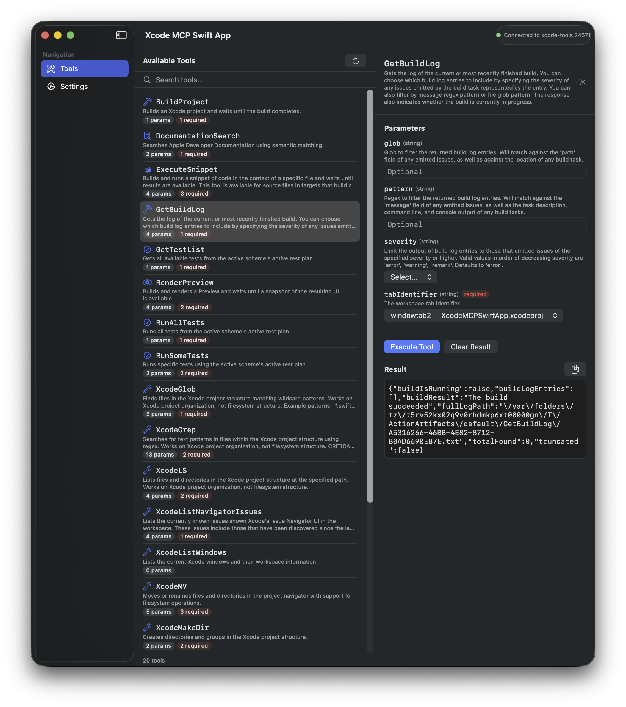
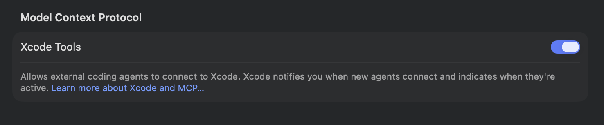
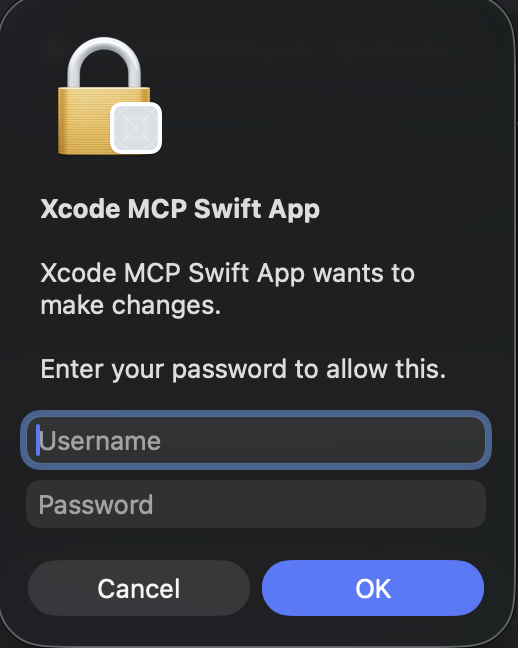
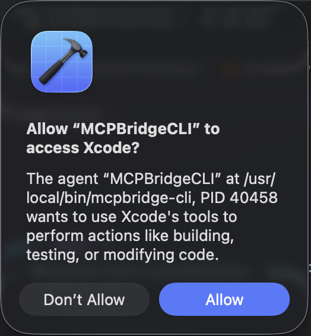

# XcodeMCPSwiftApp — Xcode MCP Tools Explorer

A macOS app that connects to Xcode 26.3's MCP (Model Context Protocol) bridge to discover and execute
the native MCP tools Xcode exposes — similar to how Cursor or Codex connect to Xcode's agentic coding
capabilities.



## Architecture

```
┌──────────────┐  App Protocol  ┌──────────────┐  MCP JSON-RPC   ┌────────────┐  XPC   ┌───────┐
│XcodeMCPSwift │ ◄────────────► │ MCPBridgeCLI │ ◄─────────────► │ mcpbridge  │ ◄────► │ Xcode │
│  App(SwiftUI)│   stdin/stdout │ (MCP Client) │   stdin/stdout  │ (Apple)    │        │ (IDE) │
└──────────────┘                └──────────────┘                 └────────────┘        └───────┘
```

**XcodeMCPSwiftApp** — macOS SwiftUI app built with The Composable Architecture (TCA).
Uses the [`XcodeMCPBridge`](https://github.com/renderplace/XcodeMCPBridge) Swift Package (via SPM)
which provides the `MCPBridgeFeature` reducer, `MCPBridgeClient` dependency, and the companion
`mcpbridge-cli` binary. The app provides a UI to connect/disconnect, browse available tools,
fill parameters, and execute them.

**mcpbridge-cli** — Companion CLI binary shipped with the
[XcodeMCPBridge](https://github.com/renderplace/XcodeMCPBridge) package. Acts as an MCP client,
communicating with Apple's `xcrun mcpbridge` via JSON-RPC 2.0 over stdio.

## Dependencies

This app depends on the [XcodeMCPBridge](https://github.com/renderplace/XcodeMCPBridge) Swift Package
(resolved automatically via SPM when you open the project in Xcode or run `xcodegen generate`).

## Prerequisites

- **macOS 14.0+**
- **Xcode 26.3** (with MCP enabled in Settings → Intelligence → "Enable Model Context Protocol")
- **A project must be open in Xcode** for the bridge to work

- Swift 5.9+
- [XcodeGen](https://github.com/yonaskolb/XcodeGen) (`brew install xcodegen`)


**Note:** Xcode MCP Tools must be enabled under the **Intelligence** settings in Xcode for the app to work correctly.



## Building

```bash
cd XcodeMCPSwiftApp

# Generate Xcode project (requires xcodegen: brew install xcodegen)
xcodegen generate

# Or build from command line
xcodebuild -project XcodeMCPSwiftApp.xcodeproj -scheme XcodeMCPSwiftApp -destination 'platform=macOS' build
```

To run the app, open `XcodeMCPSwiftApp.xcodeproj` in Xcode, select the **XcodeMCPSwiftApp** scheme, and Run (⌘R).

## Usage

1. Open `XcodeMCPSwiftApp.xcodeproj` in Xcode and run the **XcodeMCPSwiftApp** scheme
2. On first launch, the app installs the `mcpbridge-cli` binary from the [XcodeMCPBridge](https://github.com/renderplace/XcodeMCPBridge) package. This requires administrator privileges:

   

3. Make sure Xcode 26.3 is running with a project open and MCP is enabled
4. Click **Connect** — the app will launch the CLI, which connects to Xcode's MCP bridge
5. Apple will prompt you to allow the CLI to access Xcode — click **Allow**:

   

6. Switch to the **Tools** tab to see all available Xcode MCP tools
7. Select a tool, fill in parameters, and click **Execute Tool**

## Project Structure

```
project.yml                             # XcodeGen spec → XcodeMCPSwiftApp.xcodeproj
XcodeMCPSwiftApp.xcodeproj/             # Generated Xcode project (macOS app)
Sources/
└── XcodeMCPSwiftApp/                   # macOS SwiftUI app (TCA)
    ├── XcodeMCPSwiftApp.swift          # @main App entry
    ├── Features/
    │   ├── AppFeature.swift            # Root TCA reducer
    │   ├── ToolListFeature.swift       # Tool discovery & listing
    │   └── ToolCallFeature.swift       # Tool execution with parameters
    ├── Views/
    │   ├── AppView.swift               # Main window, sidebar, settings
    │   ├── AboutView.swift             # About screen
    │   ├── ToolListView.swift          # Tool list with search
    │   └── ToolCallView.swift          # Dynamic parameter form + results
    └── Services/
        └── BridgeClient.swift          # TCA dependency (Process management)
```

## Environment Variables

The CLI respects these environment variables (can be set before connecting):

- `MCP_XCODE_PID` — Target a specific Xcode instance when multiple are running
- `MCP_XCODE_SESSION_ID` — Optional UUID identifying the tool session

## Available Xcode MCP Tools

Xcode 26.3 ships with ~20 native MCP tools including:

- **BuildProject** — Build an Xcode project
- **RunAllTests** / **RunSomeTests** — Run test suites
- **DocumentationSearch** — Search Apple developer documentation
- **RenderPreview** — Render SwiftUI previews
- **GetProjectStructure** — Explore project file hierarchy
- **GetSchemes** — List available build schemes
- And more (file management, snippets, etc.)

---

> *"Built by a developer, for developers — because the best tools are the ones you'd want to use yourself."* ❤️
>
> — **Anton Gregorn** · [@renderplace](https://x.com/renderplace)

## License

MIT License

Copyright © 2026 Anton Gregorn. All rights reserved.

Permission is hereby granted, free of charge, to any person obtaining a copy
of this software and associated documentation files (the "Software"), to deal
in the Software without restriction, including without limitation the rights
to use, copy, modify, merge, publish, distribute, sublicense, and/or sell
copies of the Software, and to permit persons to whom the Software is
furnished to do so, subject to the following conditions:

The above copyright notice and this permission notice shall be included in all
copies or substantial portions of the Software.

THE SOFTWARE IS PROVIDED "AS IS", WITHOUT WARRANTY OF ANY KIND, EXPRESS OR
IMPLIED, INCLUDING BUT NOT LIMITED TO THE WARRANTIES OF MERCHANTABILITY,
FITNESS FOR A PARTICULAR PURPOSE AND NONINFRINGEMENT. IN NO EVENT SHALL THE
AUTHORS OR COPYRIGHT HOLDERS BE LIABLE FOR ANY CLAIM, DAMAGES OR OTHER
LIABILITY, WHETHER IN AN ACTION OF CONTRACT, TORT OR OTHERWISE, ARISING FROM,
OUT OF OR IN CONNECTION WITH THE SOFTWARE OR THE USE OR OTHER DEALINGS IN THE
SOFTWARE.
